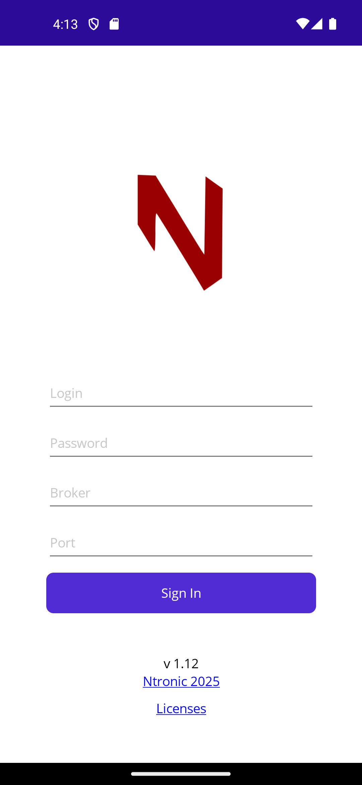
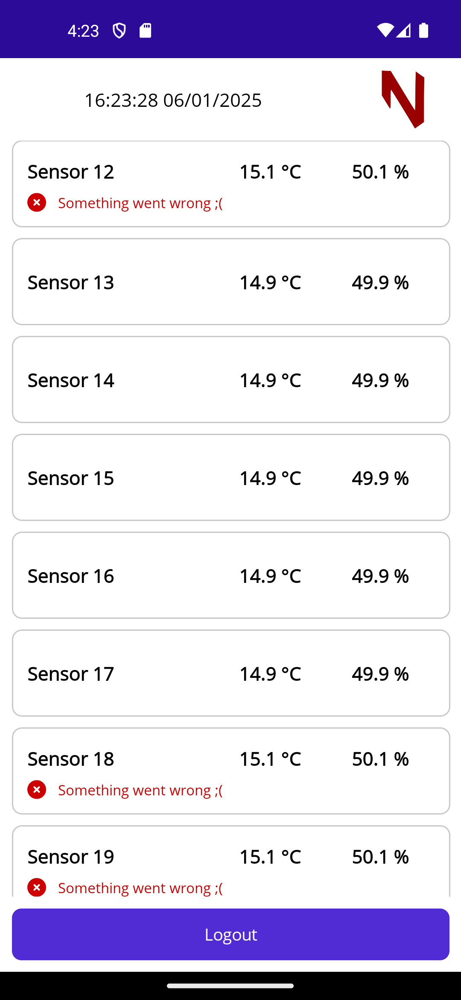
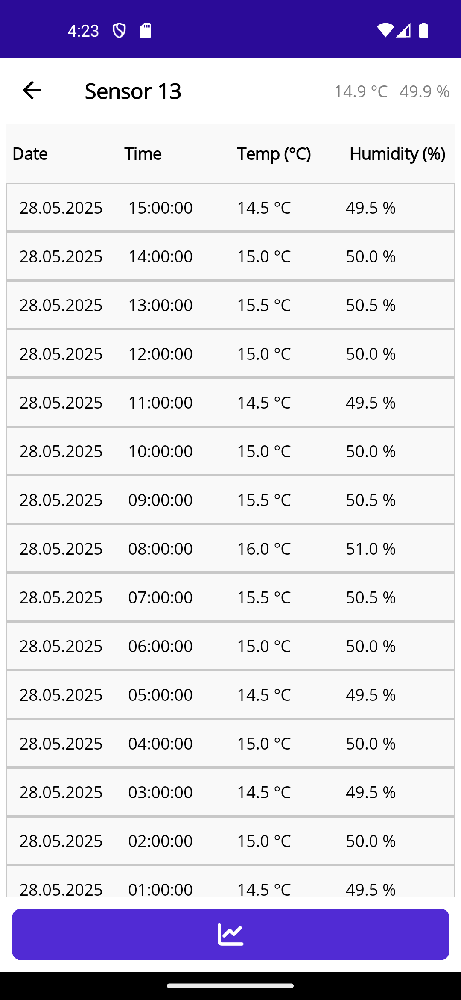
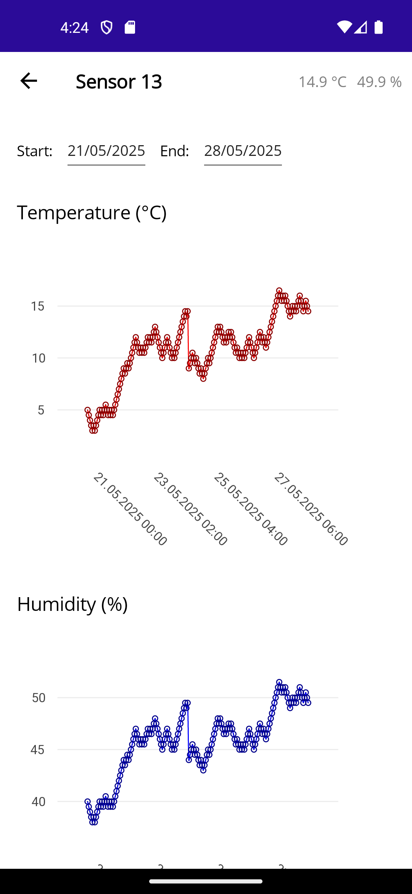

# NtroMonit

Monitoruj temperaturę i wilgotność z TD2 – dane na żywo i historia pomiarów.

## Opis

Aplikacja NtroMonit umożliwia monitorowanie pomiarów temperatury i wilgotności z przetwornika TD2. Dzięki niej odczytasz dane z nawet 40 czujników temperatury jednocześnie.

Kluczowe funkcje aplikacji:
 - ✅ Odczyt danych w czasie rzeczywistym z przetwornika TD2
 - ✅ Obsługa do 40 czujników
 - ✅ Odczyt historii pomiarów temperatury i wilgotności
 - ✅ Wykres zmian w czasie

## Widok aplikacji

